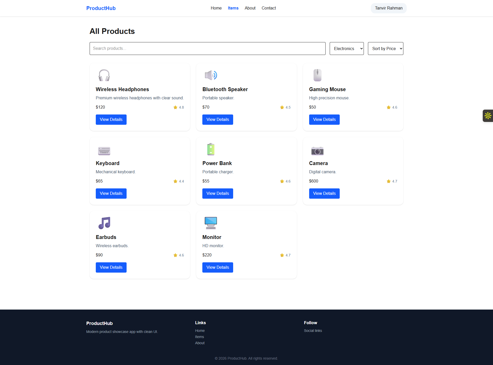
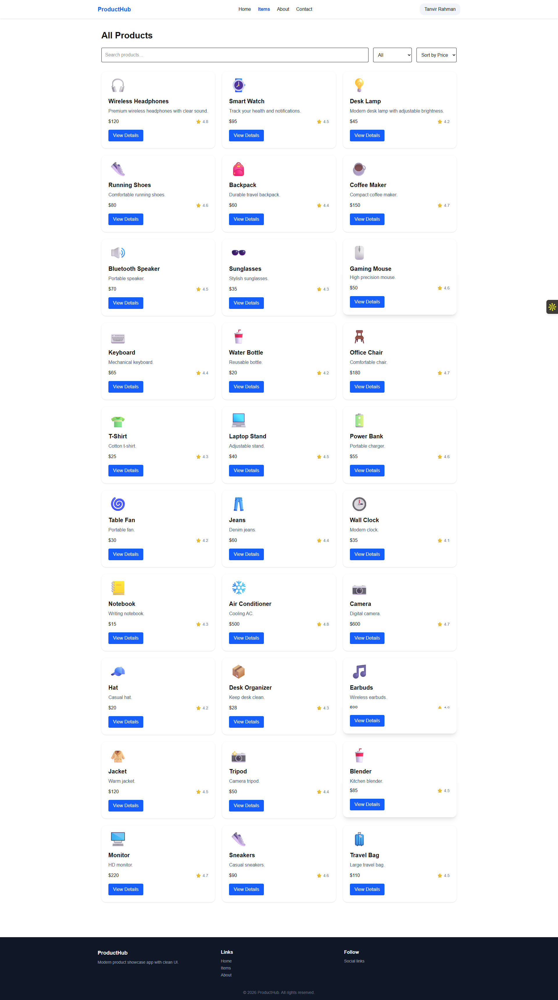
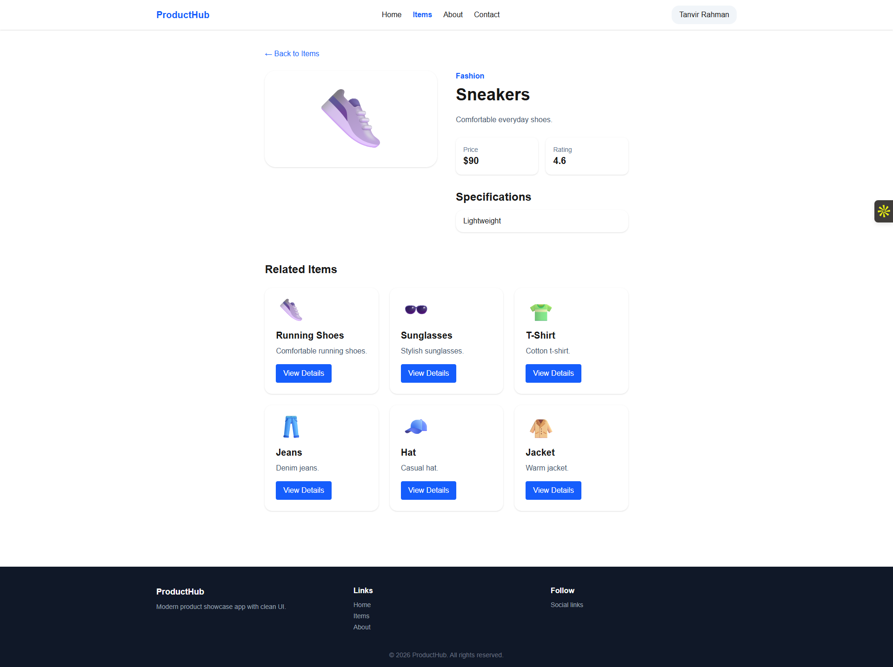
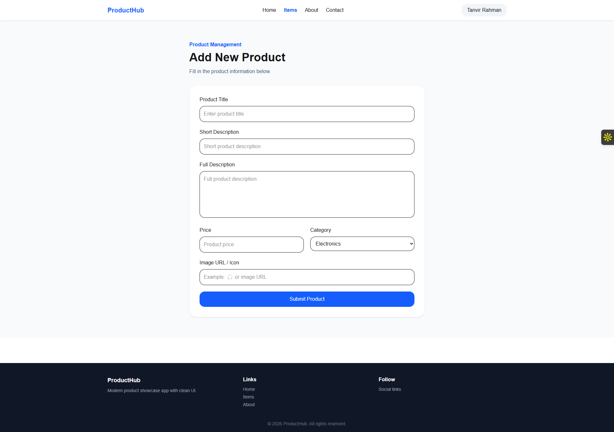
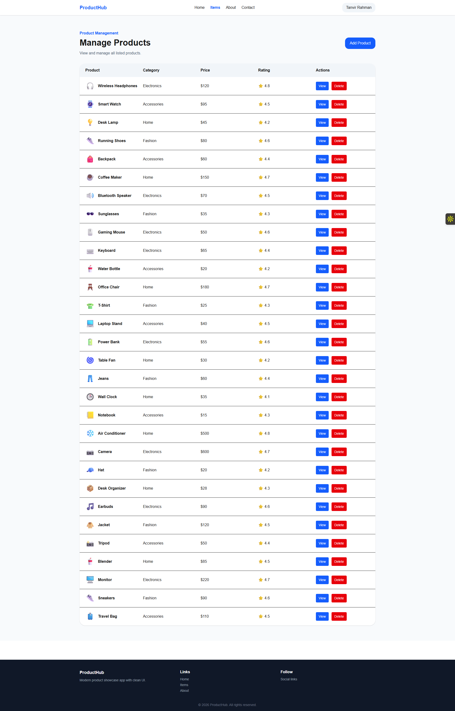

# 🛍️ ProductHub

ProductHub is a modern product management and showcase web application built with **Next.js (App Router)** and **Firebase Authentication**.  
It allows users to explore products, view details, and manage their own products through a clean and responsive interface.

---

## 🌐 Live Demo

🔗 Live Site: https://product-hub-bice.vercel.app/  
💻 GitHub Repo: https://github.com/TanvirRahman888/product-hub

---

## 📸 Screenshots


### 🏠 Home Page


### 📦 Items Page


### 🔍 Product Details


### ➕ Add Product


### 📊 Manage Products


---

## 🚀 Features

### 🔹 Public Features
- Modern Landing Page with multiple sections
- Product listing page with:
  - Search functionality
  - Category filtering
  - Price sorting (Low → High / High → Low)
- Product details page with:
  - Full description
  - Specifications
  - Related products
- About and Contact pages

### 🔹 Authentication (Firebase)
- Email & Password login/register
- Google login
- Persistent user session using Context API

### 🔹 Protected Features
- Add Product page (only for logged-in users)
- Manage Products page:
  - View all products
  - Delete products
- Navbar updates dynamically after login

### 🔹 UI/UX
- Fully responsive design (mobile, tablet, desktop)
- Clean layout with consistent spacing
- Hover and focus states
- Toast notifications
- Dark mode support

---

## 🛠️ Tech Stack

- **Frontend:** Next.js (App Router), React, Tailwind CSS  
- **Authentication:** Firebase  
- **State Management:** React Context API  
- **Notifications:** React Hot Toast  
- **Deployment:** Vercel  

---

## ⚙️ Setup & Installation

### 1. Clone the repository

```bash
git clone https://github.com/TanvirRahman888/product-hub.git
cd product-hub
```

### 2. Install dependencies

```bash
npm install
```

### 3. Create environment file

Create a `.env.local` file in the root and add:

```env
NEXT_PUBLIC_FIREBASE_API_KEY=your_api_key
NEXT_PUBLIC_FIREBASE_AUTH_DOMAIN=your_auth_domain
NEXT_PUBLIC_FIREBASE_PROJECT_ID=your_project_id
NEXT_PUBLIC_FIREBASE_STORAGE_BUCKET=your_storage_bucket
NEXT_PUBLIC_FIREBASE_MESSAGING_SENDER_ID=your_sender_id
NEXT_PUBLIC_FIREBASE_APP_ID=your_app_id
```

### 4. Run the project

```bash
npm run dev
```

Open in browser:

```
http://localhost:3000
```

---

## 🔐 Firebase Setup

1. Create a Firebase project  
2. Enable Authentication:
   - Email/Password
   - Google Sign-in  
3. Add your Vercel domain to **Authorized Domains**

---

## 📄 Routes Overview

| Route | Description |
|------|------------|
| `/` | Landing page |
| `/items` | All products page |
| `/items/[id]` | Product details page |
| `/about` | About the application |
| `/contact` | Contact form |
| `/login` | User login |
| `/register` | User registration |
| `/items/add` | Add product (Protected) |
| `/items/manage` | Manage products (Protected) |

---

## 📦 Product Data

- Static products (30 items)
- User-added products stored in `localStorage`
- Dynamic rendering across pages

---

## 🔒 Protected Routes

The following routes require authentication:

- `/items/add`
- `/items/manage`

Unauthorized users are redirected to `/login`.

---

## 🚀 Deployment

Deployed on **Vercel**:

1. Push code to GitHub  
2. Import project in Vercel  
3. Add environment variables  
4. Deploy  

---

## 📌 Future Improvements

- MongoDB integration (backend)
- Real API (CRUD operations)
- Pagination / Load more
- Product editing
- Image upload support

---

## 👨‍💻 Author

**Tanvir Rahman**  
🔗 GitHub: https://github.com/TanvirRahman888

---

## ⭐ Final Note

This project focuses on:
- Clean UI design
- Proper structure
- Authentication flow
- Real-world app layout

Perfect for learning **Next.js + Firebase + UI design** 🚀